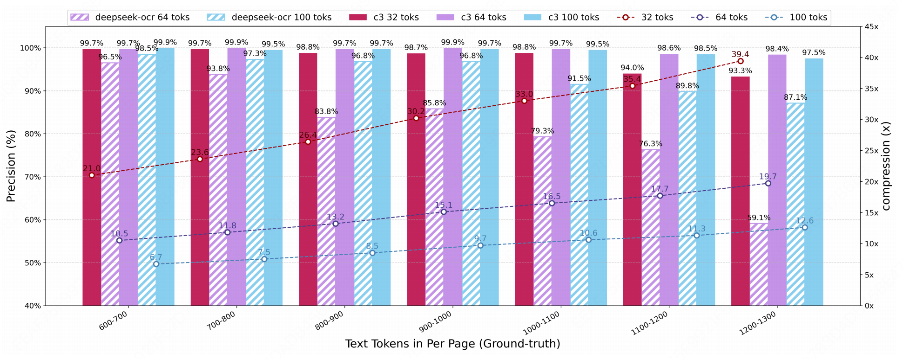
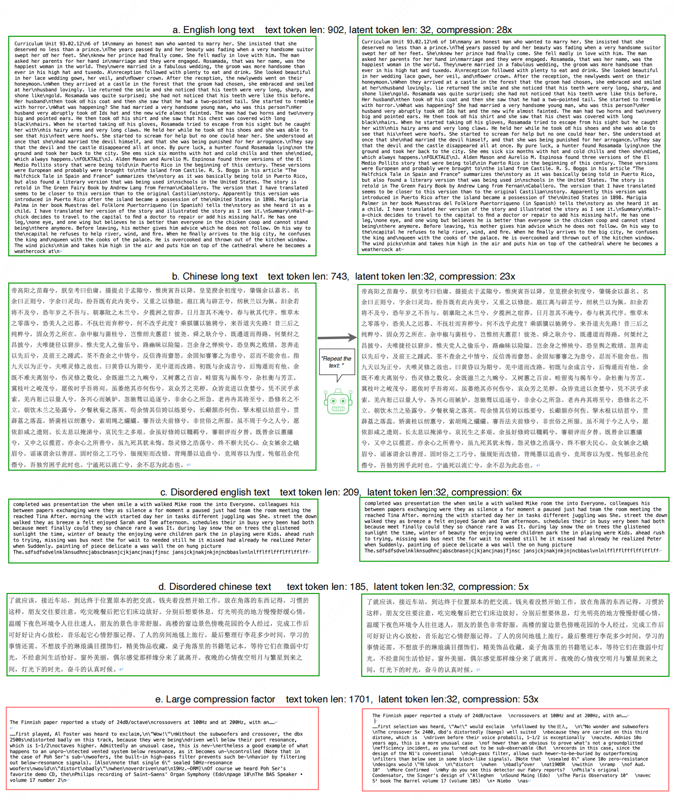

<h3><a href="">Context Cascade Compression: Exploring the Upper Limits of Text Compression</a></h3>

<a href="https://huggingface.co/liufanfanlff/C3-Context-Cascade-Compression"></a>
<a href="https://arxiv.org/abs/2511.15244"></a> 


[Fanfan Liu](https://scholar.google.com/citations?user=LPaXZEUAAAAJ&hl=en), [Haibo Qiu](https://scholar.google.com/citations?user=O5gH5vkAAAAJ&hl=en)


<p align="center">

</p> 


## Release
- [2026/1/13]🔥🔥🔥 We open-sourced the training code！
- [2025/11/20]🔥🔥🔥 We open-source the codes, weights. The paper can be found in this [repo](https://github.com/liufanfanlff/C3-Context-Cascade-Compression/blob/main/C3.pdf).  
- [2025/11/20]🔥🔥🔥 We release the C3 model! 


[](https://github.com/tatsu-lab/stanford_alpaca/blob/main/LICENSE)
[](https://github.com/tatsu-lab/stanford_alpaca/blob/main/DATA_LICENSE)


## Contents
- [Install](#install)
- [Weights](#weights)
- [Benchmarks](#benchmarks)
- [Demo](#demo)


## Install

1. Clone this repository and navigate to the C3 folder
```bash
git clone https://github.com/liufanfanlff/C3-Context-Cascade-Compression.git
```
2. Install Package
```Shell
conda create -n got python=3.10 -y
conda activate got
pip install six==1.17.0 torch==2.6.0 torchvision==0.21.0 torchaudio==2.6.0 --index-url https://download.pytorch.org/whl/cu118
pip install transformers==4.49.0 transformers-stream-generator==0.0.5

```

## Weights
- [Huggingface](https://huggingface.co/liufanfanlff/C3-Context-Cascade-Compression) （Version with 32 latent tokens）


## Benchmarks
- [Fox](https://github.com/ucaslcl/Fox)

## Demo
Transformers:
```Shell
from transformers import AutoModel, AutoTokenizer

model_name = 'liufanfanlff/C3-Context-Cascade-Compression'
tokenizer = AutoTokenizer.from_pretrained(model_name, trust_remote_code=True)
model = AutoModel.from_pretrained(model_name , trust_remote_code=True, low_cpu_mem_usage=True, device_map='cuda', use_safetensors=True, pad_token_id=tokenizer.eos_token_id)
model = model.eval().cuda()
prompt = 'Repeat the text: '
context = "帝高阳之苗裔兮，朕皇考曰伯庸。摄提贞于孟陬兮，"
#context = "lfflfflfflfflfflfflfflfflff"
outputs = model.chat(tokenizer, context, prompt)
print ("Repeat the text: ",outputs)
```
or you can:
```Shell
python3 /C3-master/C3-hf/run_c3.py
 ```

## Train
```Shell
export PYTHONPATH=../C3-Context-Cascade-Compression/C3-master:$PYTHONPATH

deepspeed C3-master/C3/train/train.py \
 --deepspeed C3-master/zero_config/zero2.json  \
 --model_name_or_path  ../C3_model_path \
 --use_im_start_end True   \
 --bf16 True   \
 --gradient_accumulation_steps 16    \
 --evaluation_strategy "no"   \
 --save_strategy "steps"  \
 --save_steps 5000   \
 --save_total_limit 1   \
 --weight_decay 0.    \
 --warmup_ratio 0.01     \
 --lr_scheduler_type "cosine"    \
 --tf32 True     \
 --model_max_length 8192    \
 --gradient_checkpointing True   \
 --dataloader_num_workers 8    \
 --report_to none  \
 --per_device_train_batch_size 2    \
 --num_train_epochs 5  \
 --learning_rate 1e-5   \
 --data_path  ../dataset/train_test_data.json \
 --output_dir ../output_dir \
 --run_name context_32 \
 --logging_steps 10 \
 ```

viz
<p align="center">

</p>


## Contact

Don't hesitate to contact me by email, liufanfan19@mails.ucas.ac.cn, if you have any questions.

## Acknowledgement
- [DeepSeek-OCR](https://github.com/deepseek-ai/DeepSeek-OCR): the idea originated from reconsideration of this work.
- [GOT-OCR2.0](https://github.com/Ucas-HaoranWei/GOT-OCR2.0): the code was adapted from GOT-OCR2.0.
- [Qwen](https://github.com/QwenLM/Qwen): the LLM base model of C3.


## Citation
```bibtex
@article{liu2025context,
  title={Context Cascade Compression: Exploring the Upper Limits of Text Compression},
  author={Liu, Fanfan and Qiu, Haibo},
  journal={arXiv preprint arXiv:2511.15244},
  year={2025}
}


